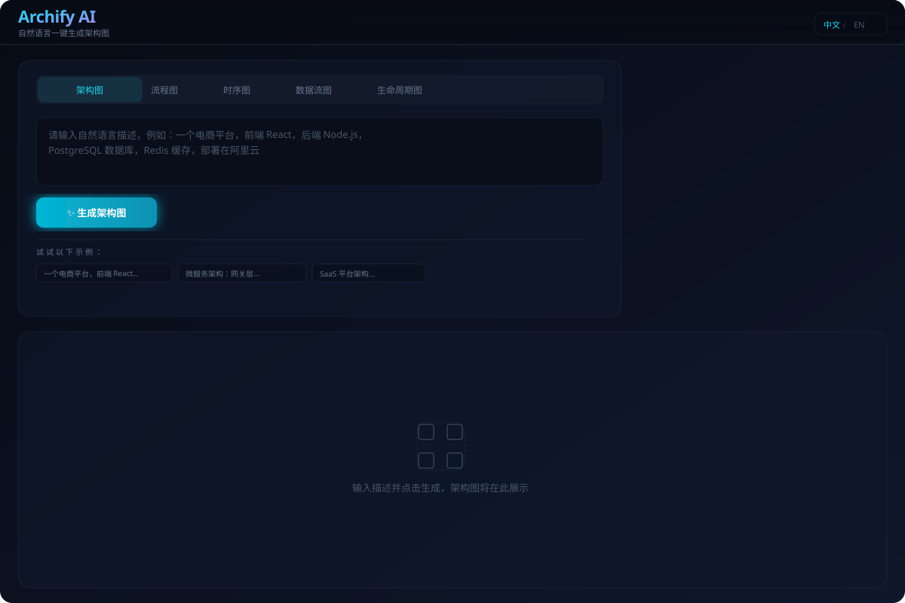
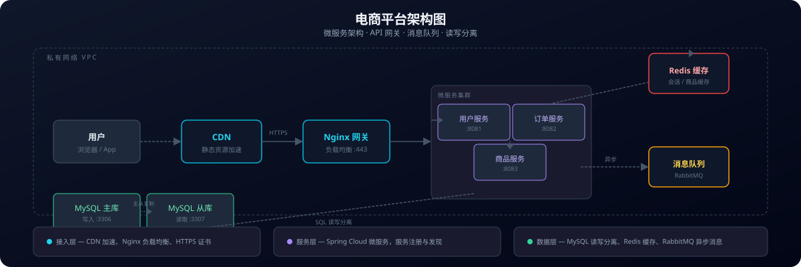

# Archify AI

<div align="center">

**Natural Language → Professional Architecture Diagrams**

[](LICENSE)
[](https://nodejs.org)
[](CONTRIBUTING.md)

[Read in English](README.md) · [中文版](README.zh-CN.md)

</div>

---

## 🚀 Turn Ideas into Architecture Diagrams in Seconds

**Archify AI** is an open-source tool that generates **professional-grade system architecture diagrams** from plain natural language descriptions. Powered by LLM (DeepSeek / OpenAI) and a custom SVG renderer, it helps engineers, architects, and students visualize complex systems instantly.

### ✨ Why Archify AI?

| Problem | Solution |
|---------|----------|
| "Drawing diagrams is tedious" | **Describe it once** — Archify generates the diagram |
| "Tools are too complex" | **Zero learning curve** — no drag-and-drop, no shape libraries |
| "Diagrams get outdated" | **Regenerate anytime** — just update the description |
| "Can't find the right tool" | **Open source & free** — self-host or use online |

### 🔥 Key Features

- **🤖 AI-Powered Generation** — Describe your system in natural language, get a professional diagram JSON
- **📊 5 Diagram Types** — Architecture, Workflow, Sequence, Dataflow, Lifecycle
- **🎨 Premium SVG Rendering** — Clean, modern, publication-quality output
- **🌐 Bilingual (中文 / English)** — Switch languages on the fly
- **📦 Multiple Export Formats** — PNG, JPEG, WebP, SVG, clipboard copy
- **🌙 Dark Theme** — Eye-candy glassmorphism design
- **🔌 API-First Design** — REST API for easy integration
- **🆓 Open Source** — MIT license, free for any use

### 🖼️ Preview

<p align="center">
  
  <br/>
  <em>AI-powered architecture diagram generator — describe your system, get a professional diagram</em>
</p>

<p align="center">
  
  <br/>
  <em>Example: E-commerce platform architecture (microservices, API gateway, message queue, read-write split)</em>
</p>

### 🏗️ Architecture

```
User Input (Natural Language)
        │
        ▼
┌─────────────────┐     ┌──────────────┐
│   Frontend       │────▶│  Backend API  │
│  (React + Vite)  │◀────│  (Express)    │
└─────────────────┘     └──────┬───────┘
                               │
                      ┌────────▼────────┐
                      │   LLM Service    │
                      │ (DeepSeek/GPT)   │
                      └────────┬────────┘
                               │
                      ┌────────▼────────┐
                      │   JSON → HTML    │
                      │  SVG Renderer    │
                      └─────────────────┘
```

### 🛠️ Tech Stack

| Layer | Technology |
|-------|-----------|
| **Frontend** | React 18, TypeScript, Vite 6, Tailwind CSS v4, shadcn/ui |
| **Backend** | Node.js, Express, TypeScript, tsx |
| **LLM** | DeepSeek / OpenAI compatible API |
| **Rendering** | Custom SVG renderer (7 diagram types) |
| **i18n** | react-i18next (中文 / English) |
| **Monorepo** | npm workspaces |

### 📦 Quick Start

```bash
# 1. Clone
git clone https://github.com/your-username/archify.git
cd archify

# 2. Install
npm install

# 3. Configure LLM
cp .env.example .env
# Edit .env — set LLM_API_KEY

# 4. Start (frontend + backend)
npm run dev

# Open http://localhost:5173
```

### 🔧 Configuration

All config via `.env`:

```env
# LLM Provider (DeepSeek / OpenAI compatible)
LLM_API_KEY=sk-xxx
LLM_BASE_URL=https://api.deepseek.com
LLM_MODEL=deepseek-chat
LLM_TIMEOUT=60000
LLM_MAX_RETRIES=2

# Server
PORT=3001
```

### 📡 API

```bash
# Generate diagram JSON from natural language
curl -X POST http://localhost:3001/api/generate \
  -H 'Content-Type: application/json' \
  -d '{"prompt":"微服务电商平台","diagramType":"architecture","language":"zh"}'

# Render JSON to HTML
curl -X POST http://localhost:3001/api/render \
  -H 'Content-Type: application/json' \
  -d '{"json":{...},"diagramType":"architecture"}'
```

### 🤝 Contributing

PRs welcome! See [CONTRIBUTING.md](CONTRIBUTING.md) for guidelines.

### � License

[MIT](LICENSE)
